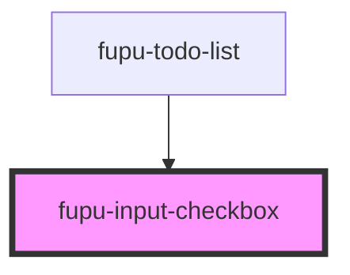

# fupu-input-checkbox

<!-- Auto Generated Below -->

## Properties

| Property     | Attribute     | Description | Type     | Default     |
| ------------ | ------------- | ----------- | -------- | ----------- |
| `checkboxId` | `checkbox-id` |             | `string` | `undefined` |
| `value`      | `value`       |             | `string` | `undefined` |

## Events

| Event                     | Description | Type                   |
| ------------------------- | ----------- | ---------------------- |
| `fupuInputCheckboxChange` |             | `CustomEvent<boolean>` |

## Dependencies

### Used by

 - [fupu-todo-list](../fupu-todo-list)

### Graph

----------------------------------------------

*Built with [StencilJS](https://stenciljs.com/)*
