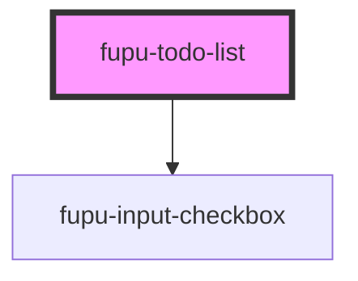

# fupu-todo-list

<!-- Auto Generated Below -->

## Properties

| Property    | Attribute    | Description | Type                            | Default    |
| ----------- | ------------ | ----------- | ------------------------------- | ---------- |
| `todoList`  | `todo-list`  |             | `TodoListItemModel[] \| string` | `"[]"`     |
| `todoTitle` | `todo-title` |             | `string`                        | `"Título"` |

## Events

| Event                | Description | Type                               |
| -------------------- | ----------- | ---------------------------------- |
| `fupuTodoListChange` |             | `CustomEvent<TodoListItemModel[]>` |

## Dependencies

### Depends on

- [fupu-input-checkbox](../fupu-input-checkbox)

### Graph

----------------------------------------------

*Built with [StencilJS](https://stenciljs.com/)*
